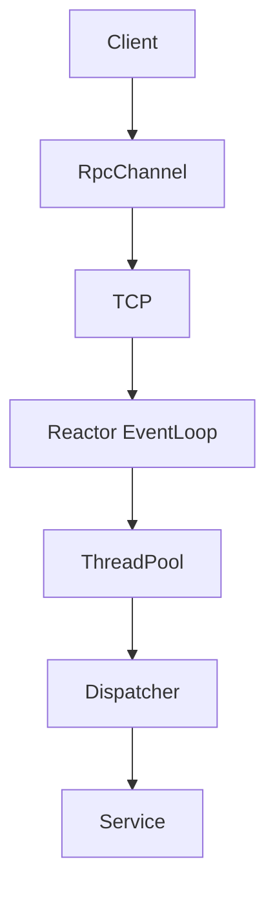
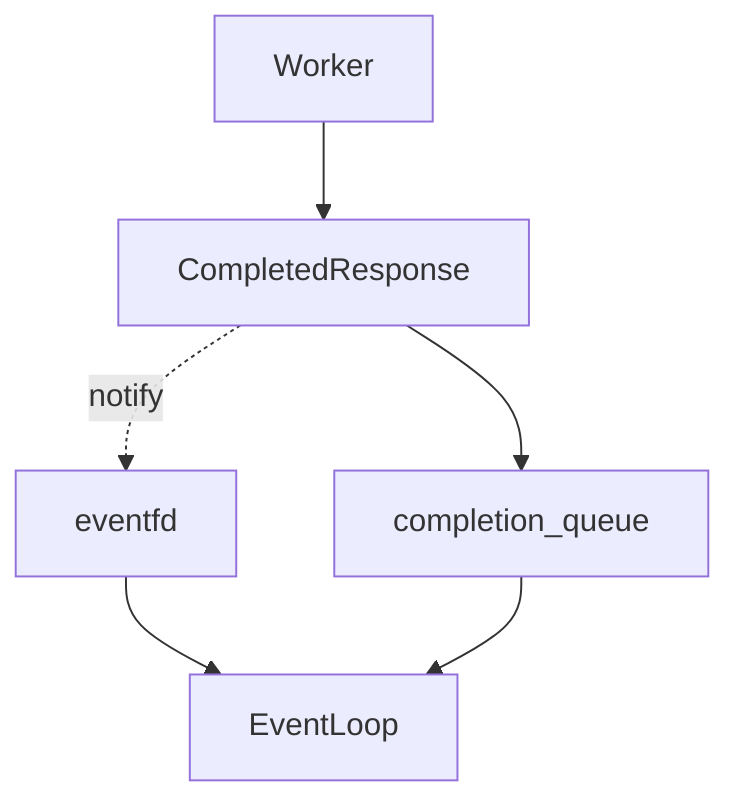
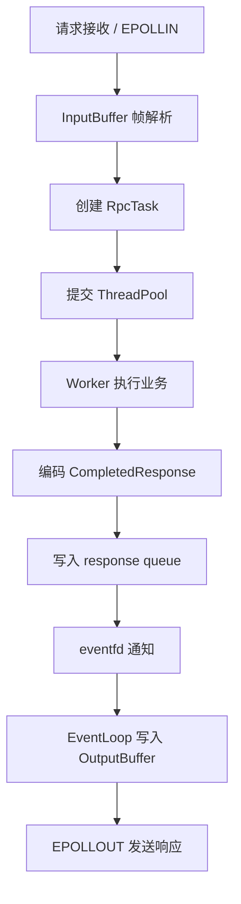

# MiniRPC

## 项目简介

MiniRPC 是一个基于 C++17 和 Linux 实现的高性能异步 RPC 框架。服务端采用 epoll Reactor 处理网络事件，通过 ThreadPool 异步执行 RPC 业务，并使用 eventfd 将 worker 完成事件通知给 EventLoop。

项目聚焦 RPC 框架的核心工程问题，包括协议编解码、非阻塞网络 I/O、线程边界、连接生命周期、过载保护和优雅关闭。当前 `RpcChannel` 保持同步调用接口，服务端业务执行采用异步模型。

## 核心特性

- **epoll Reactor**：EventLoop 统一处理监听 socket、客户端连接和 eventfd 事件。
- **非阻塞 I/O**：服务端连接使用非阻塞 socket，通过 `EPOLLIN` / `EPOLLOUT` 驱动读写状态。
- **Protobuf serialization**：使用 Protocol Buffers 序列化请求参数和响应数据。
- **自定义 RPC 协议**：支持请求/响应 Header、request ID、magic、version 和消息长度校验。
- **ThreadPool 异步执行**：网络线程只负责 I/O、帧解析和连接管理，worker 负责 Dispatcher 调用及响应编码。
- **eventfd 线程通知**：worker 写入完成队列后通过 eventfd 唤醒阻塞中的 EventLoop。
- **连接生命周期管理**：通过独立 `connection_id` 路由异步响应，避免 fd 复用造成响应错投。
- **过载保护**：线程池任务队列满载时返回 `RPC_SERVER_BUSY`，不阻塞 EventLoop。
- **优雅关闭**：`RpcServer::Stop()` 唤醒 EventLoop，按顺序关闭监听 socket、客户端连接和 ThreadPool。
- **Logger**：提供带时间戳、日志级别、文件名和行号的线程安全日志。
- **CTest**：通过 CTest 统一运行 buffer、connection 和 epoller 测试。

## 系统架构

### 请求执行路径



### Worker 完成通知路径



`CompletedResponse` 数据保存在受互斥量保护的完成队列中；eventfd 只传递唤醒通知。EventLoop 被唤醒后读取队列，并通过 `connection_id -> fd` 索引定位仍然有效的连接。

## 请求流程



1. EventLoop 收到客户端 `EPOLLIN` 事件，将数据读取到连接的 `InputBuffer`。
2. EventLoop 按自定义协议解析完整请求帧，并校验 magic、version 和消息长度。
3. 解析结果被复制到只包含值类型数据的 `RpcTask`，提交给 ThreadPool。
4. Worker 检查方法是否存在，通过 Dispatcher 执行业务 Handler，并编码响应。
5. Worker 将 `CompletedResponse` 写入 `completion_queue`，随后写 eventfd。
6. EventLoop 从 epoll 唤醒，读取 eventfd 并批量处理完成响应。
7. EventLoop 通过 `connection_id` 查询连接；连接已关闭时直接丢弃迟到响应。
8. 有效响应追加到连接的 `OutputBuffer`，开启 `EPOLLOUT`，由 EventLoop 完成发送。

单个连接当前最多保留一个 in-flight worker 任务，以兼容同步 `RpcChannel` 的请求模型。

## RPC 协议

请求和响应均采用长度前缀帧：

```text
+---------------------+
| Header Size (uint32)|
+---------------------+
| Protobuf Header     |
+---------------------+
| Payload             |
+---------------------+
```

协议 Header 包含 request ID、payload size、magic 和 version；请求 Header 额外包含 service name 与 method name。服务端对 Header 和 Payload 设置最大长度限制。

## 快速开始

### 环境要求

- Linux 或 WSL
- 支持 C++17 的编译器
- CMake 3.16+
- Protobuf 编译器和开发库

Ubuntu / Debian 可安装：

```bash
sudo apt update
sudo apt install build-essential cmake protobuf-compiler libprotobuf-dev
```

### 编译

```bash
cmake -S . -B build-release -DCMAKE_BUILD_TYPE=Release
cmake --build build-release -j$(nproc)
```

### 运行示例

启动 Calculator 服务：

```bash
./build-release/rpc_server
```

运行客户端：

```bash
./build-release/rpc_client
```

### 运行测试

```bash
ctest --test-dir build-release --output-on-failure
```

## 性能测试

Benchmark 使用多个客户端线程并发执行 Calculator RPC。请在记录结果时同时填写硬件和软件环境，避免脱离环境比较数据。

### 测试环境

| 项目 | 配置 |
|---|---|
| CPU | |
| OS | |
| Compiler | |

### 测试命令

```bash
./build-release/rpc_benchmark 16 10000
```

### 测试结果

| 指标 | 结果 |
|---|---:|
| QPS | |
| Average Latency | |
| P50 | |
| P95 | |
| P99 | |

## Logger

核心模块使用流式日志宏：

```cpp
LOG_INFO() << "Client connected fd=" << fd;
LOG_WARN() << "recv failed";
LOG_ERROR() << "invalid rpc magic";
LOG_DEBUG() << "connection closed";
```

输出示例：

```text
[INFO] 2026-09-02 17:05:24.488 [rpc_server.cpp:1158] Client connected fd=5
```

默认日志级别为 INFO，可通过 `minirpc::Logger::SetLevel()` 调整。

## 项目结构

```text
MiniRPC/
├── include/minirpc/     # 对外头文件与核心组件接口
├── src/minirpc/         # Reactor、RPC、线程池、Logger 等实现
├── examples/calculator/ # Calculator 服务端和客户端示例
├── proto/               # MiniRPC Header 等 Protobuf 协议定义
├── tests/               # RpcBuffer、RpcConnection、Epoller 测试
├── benchmarks/          # 并发 RPC benchmark
└── CMakeLists.txt       # 构建目标与 CTest 配置
```

- `include/`：公开头文件，包括 RpcServer、RpcChannel、RpcConnection、Dispatcher、ThreadPool 和 Logger。
- `src/`：框架实现以及协议编解码、buffer、epoll 等基础组件。
- `examples/`：可直接运行的 Calculator RPC 示例及业务 Service。
- `proto/`：RPC Header 的 Protobuf schema；示例业务协议位于 `examples/calculator/`。
- `tests/`：无需外部测试框架的独立测试程序，由 CTest 统一执行。

## 当前边界

- `RpcChannel` 当前提供同步调用接口。
- 单连接同时最多执行一个 RPC worker 任务，不支持请求 pipeline。
- 当前面向 Linux epoll，不提供跨平台网络后端。
